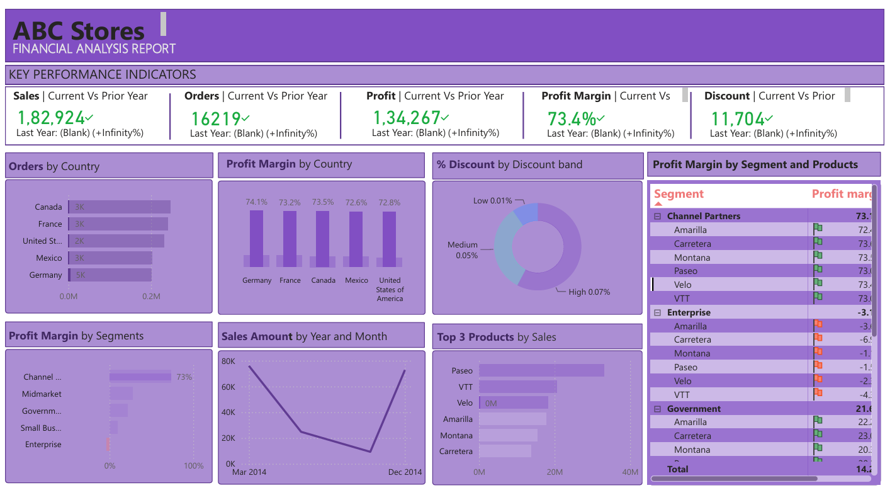

# FINANCIAL ANALYTICS PROJECT

Welcome to the **Financial Analytics Dashboard Project** repository! 🚀  
This project demonstrates a comprehensive analytics and Dashboard solution over Sales finance data, using Power BI tools to represent the actionable insights. it highlights industry best practices in Dashboard visualisation and Report analytics.

---
## Project Overview

The Project involves:

1. **Data Measures**: measures are numerical values that are calculated or aggregated to evaluate business performance.
2. **Data Modelling**: Developing fact and dimension tables optimized for analytical queries.
3. **Analytics and Reporting**: developing BI dashboard and reports for business analysis. 




This repository is an excellent resource for professionals and students looking to showcase expertise in:
1. Business Analytics
2. Data Analytics
3. Dashbording and Reporting

---

## Important Links & Tools:

- **[Real time Dashboard](https://app.powerbi.com/groups/me/reports/0952df6b-b78e-4499-9f1b-829c0785e91b/806f756a9be70432c630?bookmarkGuid=da1800f2-2506-4408-97c5-f49c97df0012&bookmarkUsage=1&ctid=7dc4d1d9-d0ae-4c8c-b4e8-e96f1e3cbd2c&portalSessionId=64fb164c-7bd4-4e24-821f-ac9df095c892&fromEntryPoint=export):** Dashboard insights using Power Point.

---

### BI: Analytics & Reporting (Data Analysis)

#### Objective
Develop SQL-based analytics to deliver detailed insights into:
- **Customer Behavior**
- **Product Performance**
- **Sales Trends**

These insights empower stakeholders with key business metrics, enabling strategic decision-making.  
## 📂 Repository Structure
```
financial-analytics-project/-
|
|- images
|   |
|   |- dashboard.png
|
|- Financial Data.xlsx
|- Financial Analysis Report.pbix
|- README.md
